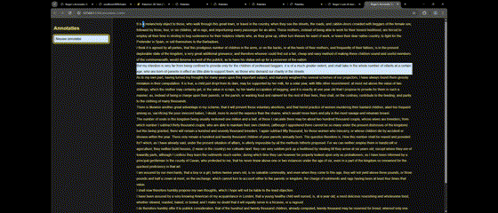
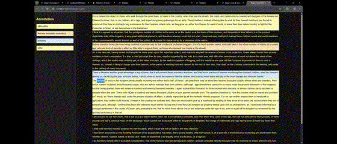
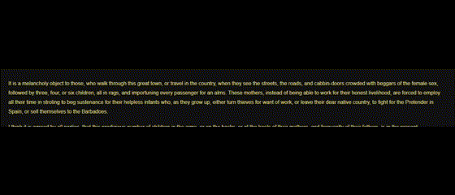
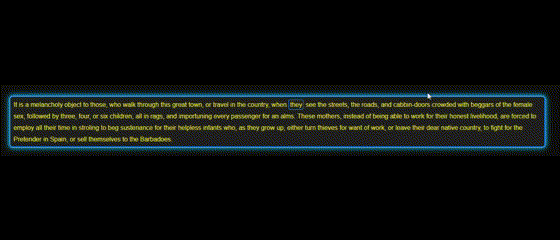
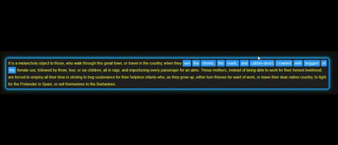
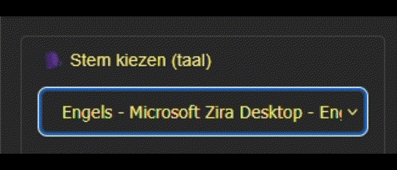

# HCD Roger

## Week 1:
Week 1 begon met het leren kennen van Roger. Wie is hij, Watvoor beperking heeft hij en wat zou hij graag willen?

HCI Roger
1.	Hoe leest Roger momenteel digitale boeken?
2.	Welke screen reader gebruikt hij?
3.	Heeft Roger al een methode om annotaties te maken? Zo ja, wat werkt wel en wat niet?
4.	Hoe vind je je annotaties nu terug?
5.	Heeft Roger een voorkeur voor gesproken annotaties, of typt hij liever?
6.	Gebruik je al bepaalde apps die je kunnen helpen met het maken van annotaties en lezen.

### Aantekeningen:
Heeft Vasilis drie jaar geleden ontmoet.  En is 58 jaar. Op zijn 43ste begon hij zijn zicht te verliezen. Heeft een erfelijke oogaandoening. Het is niet te fixen en is progressief. Makelaar degelaratie mist het centrale zicht. Zijn hersenen die kleuren dat gat in. 

Hij verzint dus wat ie ziet. 7 maanden gaan revalideren bij Bartimeus, 4 dagen in de week in het bos in Apeldoorn. Is bestuurslid van de makelaar, doet een studie in filosofie. 
250000 minder dan 30% zicht – slechtziend
100000 mensen die volledig blind zijn. 
Doet ook aan beeldhouwen. Is heel technisch en creatief. 
Met braille heb je meer een gevoel om te lezen. Luisteraudio’s triggeren een ander deel van je brein. Braille voelt eerder als lezen dan luisteradio’s. 
Het probleem is om sneller en makkelijker dingen terug te vinden. Heel moeilijk om annotaties weer terug te vinden. Via teams luistert hij bijvoorbeeld terug naar de annotaties. 
1% op de rechter en 40% op de linker. Doordat er twee beelden door elkaar gaan is het dood vermoeiend. Alleen al een lamp boven zich is al vermoeiend genoeg. 

Energie management is een ding. Licht hinder. Dark modus > maakt het minder vermoeiend.
Supernova draait op een windows computer. Op apple werkt de voiceover lekkerder. Supernova vindt hij nog steeds helemaal niks. Op de Apple is heel makkelijker werken. 
Werken met office en verschillende clouds. 

Het maken van annotaties: er is nu ook spraak tot tekst. Maakte vroeger aantekeningen in een schriftje, doordat hij toch wel aantekeningen maakt in zijn schriftje kan hij het beter onthouden. Met een actievere actie onthoud je beter. Actief onthouden. Fototjes van het bord maakt hij, door uit te zoomen kan hij het nog wel zien. Staat open voor nieuwe manieren van het maken van annotaties. 
Typen kan hij ook. Hebel bordje

Aangepast lezen, 40 euro per jaar mag hij 15 boeken op de boekenplank. Passend lezen. 
Supernova werkt niet op alle windows, het is outdated. Lettergrootte en letterdikte aanpassen. Aanpassingen op de style van de letters. Vette randen om de content heen, ::focus. Maakt een annotatie per container. Wilt liever met spraak terug kunnen vinden. Wilt precies per zin, per woord fixen. 

Het doel is dus om ervoor te zorgen dat Roger beter kan lezen zonder al teveel energie verlies. Door verschillende functies te gebruiken waarbij je met keypads bijvoorbeeld de lettertype, grootte, lineheight, gap, en dark/light modus bijvoorbeeld. Wilt graag zinnen willen kopieëren en toevoegen. Voorkeur voor tekst en als het niet kan spraak. 
Met het woordje stop, kan je dan in een menu annotaties maken enzovoort en dan wanneer je start zegt weer verder gaat met lezen. 
Uiteindelijk wilt ie zijn eigen woorden eraan maken. 
Maakt gebruik van NVDA
De stem van words luistert fijner dan NVDA en Supernova.
Verschillende grids

Functionaliteiten van de website:
-	Lettertype
-	Lettergrootte 
-	Lineheight
-	Light/dark modus
-	Verschillende grids  T | 0 | T    0 | T | 0
-	Annotaties toevoegen
-	Speech functie
-	Kleinere/ grotere muis
-	Koppenstructuur
-	Zoeken op annotatie
Geel op zwart is het fijnst
Wit is heel moeilijk, WCAG richtlijnen. Contrast richtlijnen WCAG AA AAA

## Week 2:
Ik heb mij gefocust op het maken van een screenreader dat alles opleest wat roger doet. Het kan zinnen oplezen en commandos oplezen. 

### Verse 1
Ik ben begonnen met het bouwen van een screenreader. op tab worden hier de zinnen opgelezen door de ingebouwde screenreader van de web browser. 

### Verse 2
Roger zelf vind het niet zo fijn om te werken met de muis dus heb ik ook de focus gelegd op hotkeys. Door algemene toetsen regelingen te gebruiken zoals "Tab", "Shift" ,"J", "F" enzovoort wil ik ervoor zorgen dat Roger zich gemakkelijker in de programma vloeit. Voor de kleuren vind Roger het fijn om te lezen in zwart en geel.

1. Dit is de nieuwe screenreader, zoals je kan zien worden de woorden gehighlight wanneer de screenreader dit opleest. Dit maakt het makkelijker volgen waar in de tekst Roger is. Met de "Tab" key kan je de screenreader activeren en leest ie de zin voor waarop je gefocust bent. Bij focus word er ook een blauwe border om de tekst gezet. Ik heb gekozen voor de kleur blauw omdat dit lijkt op de default van de focus en het past goed met de zwarte achtergrond.  

2. Wanneer je nu op "Enter" klikt tijdens het lezen van de tekst kan je een annotatie toevoegen. Hoor je ook "Annotatie opslaan" De getypte annotatie kan je ook laten voorlezen met de "Shift" key voordat het opgeslagen wordt. Met "Tab" kan je tabben naar opslaan en annuleren. Dit wordt ook opgelezen door de screenreader. Na opslaan kies je vervolgens een kleur voor je annotatie. De kleuren zijn pastel rood, groen, blauw. Dit zal voor Roger niet al te fel zijn. Zijn focus moet nog steeds wel liggen op de tekst en niet op wat er naast zich af speelt.  

3. Met de "A" key kan je door je annotatie heen tabben en met de "Shift" key wanneer je gefocust bent op een annotatie kan je tabben naar de zin waar je je annotatie op hebt gemaakt. De screenreader leest ook de geschreven annotatie op en de zin waarop je hebt geannoteerd wanneer je erop gefocust bent. Ook word er een commando opgeroepen dat je aan het tabben bent naar annotaties.

4. Wanneer je gefocust bent op een annotatie kan je dit veranderen door op enter te klikken. je hoort ook "Annotatie veranderen". Hier krijg je dezelfde panel als het toevoegen en kan je de tekst en de kleur weer veranderen.  

5. Wanneer je gefocust bent op een annotatie kan je de annotatie verwijderen door op "X" te klikken. Je hoort ook "Annotatie verwijderen". Je krijgt ook een bevestigingsmelding waar je op enter moet klikken om door te gaan met je actie.  

6. Door op "O" voor Options te klikken open je de settings menu. Hier kan Roger zijn settings veranderen van de screenreader en de tekst. Dit geeft hem meer controle en kan hij het ook echt zelf personaliseren. 

7. Hier zie je een "tabtrap" zo kan Roger niet tabben uit zijn annotaties wanneer hij op "A" klikt.

### Testfase

Feedback:
1. Roger vindt het heel fijn dat hij zijn settings kan veranderen. De toets zelf kan hij niet zo goed vinden. De "O" toets bijvoorbeeld klopte niet voor hem. 
2. Het maken van de annotaties ging wat moeizaam. Roger moest nog wennen aan de toetsen maar uiteindelijk ging het wel zonder hulp. Dat de annotatie wordt opgelezen die hij net heeft getypt maakt het hem wat veiliger voor dat hij geen fouten heeft getypt.
3. Roger vindt het fijn dat hij door de annotaties kan tabben en dat ie een overzicht heeft van de annotaties. Hij wilt wel dat hij meer weet waar hij is.
4. Roger kon de annotatie makkelijk aanpassen.
5. Roger kon de annotatie weer makkelijk verwijderen.

verbeteringen:
1. Roger kwam met het idee om de container van de annotatie ook aan te passen. Zo heeft hij meer controle over welk gedeelte hij wilt annoteren.
2. Roger vindt de "O" toets niet fijn dus het liefst verplaatsen naar "J" of "F".
3. Roger wilt ook een overzicht van de kopjes die zijn in het boek.

## Week 3
In week 3 heb ik mij gefocust op de selectie van de container. Dit was een belangrijk uitgangspunt van de afgelopen week. De screenreader heb ik ook veranderd dat je wel ziet waar je bent maar niet dat het je focus wegneemt. Verder heb ik nagedacht over extra functionaliteiten voor de selectie aan woorden.

1. Screenreader V3: 
2. Wanneer je getabt bent op een tekst en je klikt enter dan start je de woorden selectie functie. met de pijltjes links en rechts kan je de woorden selecteren die je wilt annoteren.  

3. Met "Shift" + pijltjes links of rechts kan je woorden uit je selectie verwijderen. Zo heeft Roger meer controle over zijn selectie.  

4. Annotatie toevoegen is hetzelfde gebleven alleen word niet meer het hele tekst gehighlight maar alleen de geselecteerde woorden.  

5. Roger kan nu makkelijker door de gemaakte annotaties tabben me "Ctrl".  

6. Ook heb ik een controls page gemaakt voor alle controls die er tot nu toe in de programma zit.  

7. Ook kan Roger nu de taal veranderen van de screenreader.  

## Week 4

### Testresults
1. Roger vond de applicatie heel fijn maar moest nog wel weer wennen aan de controls. 
2. De "J" voor het openen van de menu is niet zo handig omdat J aan de rechterkant zit van de toetsenbord en menu aan de linkerkant van het scherm. Het beste is dus om de control op "F" te zetten.
3. Roger speelde veel met de settings en vond het leuk om hier mee te knoeien.
4. De nieuwe woorden selectie vind Roger geweldig maar het werkt nog niet best. De controls zijn alsnog moeilijk te begrijpen en het was nog niet helemaal duidelijk en overzichtelijk voor Roger. De screenreader leest dit ook nog niet voor. 
5. Het maken van een annotatie ging soepeler dan eerder, Roger raakte er gewend aan.

### Wat zou ik nog meer toevoegen als ik nog meer tijd had?
1. Ik zou meer testen met de controls wat voor Roger het beste en meest logisch werkt en voelt. 
2. Het toevoegen van een boek via een word bestand.
3. Koppenstructuur, een overzicht van de koppen die zijn in de boek. 
4. Een zoek functie om makkelijker de annotaties te zoeken of de koppenstructuur. Zou leuk zijn om een voicecommand te hebben om te zoeken op een woord. Dat je meteen naar dat woordje tabt/ focust.
5. Ik zou ook meer willen testen met kleur en zicht. Welke borders het beste zijn dat wel overzichtelijk blijft maar niet zijn focust steelt van het lezen. 
